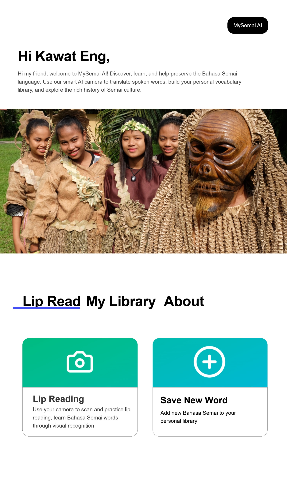
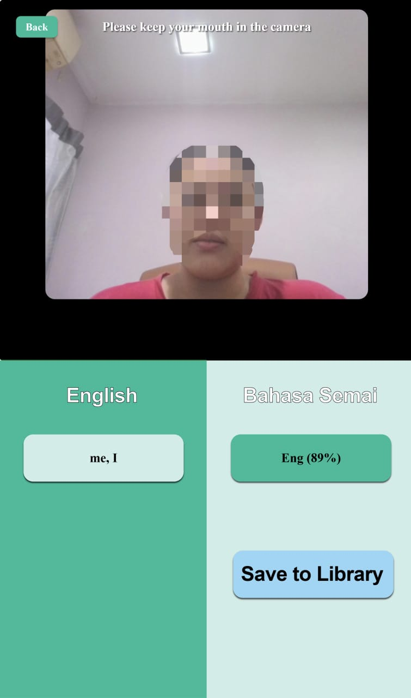
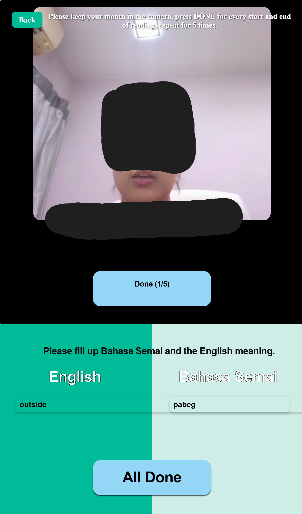
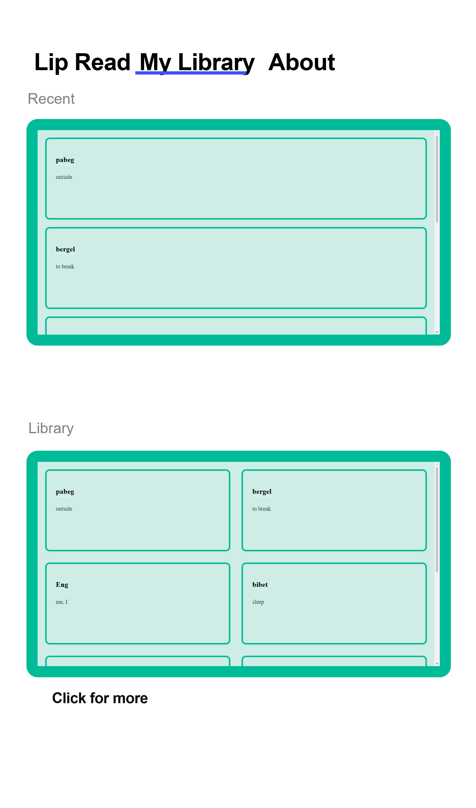
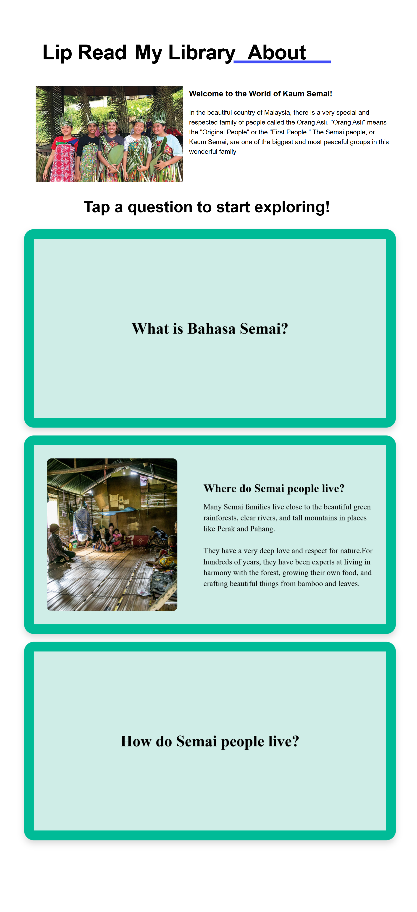

# 🌿 MySemai AI: Inidigenous Language Perservation



## 1. Project Overview

**Objective:** MySemai AI is a serverless, interactive web application designed to aid in the preservation and education of Bahasa Semai, an endangered indigenous dialect in Malaysia. The system leverages zero-shot visual AI processing to translate spoken Semai words into English via lip-reading, while empowering the community to dynamically expand a crowdsourced linguistic database.

**Sustainable Development Goals (SDGs) Addressed:**
* 📚 **SDG 4 (Quality Education):** Facilitating accessible and inclusive learning environments for native dialects.
* 🤝 **SDG 10 (Reduced Inequalities):** Empowering marginalized indigenous communities by preserving their cultural heritage.
* 🏙️ **SDG 11 (Sustainable Cities and Communities):** Safeguarding intangible cultural heritage through modern digitalization.

**Target Demographics:**
* Younger generations of the Kaum Semai seeking cultural reconnection.
* Linguists, educators, and researchers documenting endangered languages.
* The general public interested in Malaysian indigenous cultures.
* Individuals with hearing loss.

---

## 2. 📸 UI & Features

### Real-Time Visual Translation
Users can speak Bahasa Semai into the camera, and the application uses prompt-engineered AI to identify the word.


### Community Dictionary Contribution
Users record brief visual clips to add brand-new vocabulary to the dynamic local database.


### Dynamic Vocabulary Library
A real-time, community-driven dictionary that displays recently contributed words alongside a comprehensive table of all translated Bahasa Semai vocabulary pulled directly from the local SQLite database.


### Interactive Cultural Education
An interactive "About" module featuring 3D flip-cards that educate users on the history, geography, and rich cultural heritage of the Orang Asli Kaum Semai.


---

## 3. 💻 System Architecture & API Integration

To maximize efficiency and minimize computational overhead, MySemai AI bypasses traditional, resource-intensive machine learning model training. Instead, the architecture utilizes a local SQLite database integrated with the **Google Gemini 2.5 Flash Multimodal API** via contextual prompt engineering.

### Dynamic Context Injection
The system fetches updated vocabulary from the local database and injects it directly into the AI's system prompt. This allows the model to perform highly accurate, constrained zero-shot classification on video inputs without requiring localized retraining.

### Rate-Limit Protection (Fail-Safe Mechanism)
To ensure uninterrupted operation during live demonstrations, the application features a robust fallback mechanism. If the external cloud API encounters a rate limit or network failure, the system automatically intercepts the exception and serves simulated offline data from the local database.

```python
    except Exception as e:
        print(f"API Limit Intercepted: {e}")
        # Offline Fallback Mechanism
        if db_words:
            fallback_word = random.choice(db_words)
            return jsonify({
                "semai": fallback_word[0], 
                "english": fallback_word[1], 
                "confidence": f"{random.randint(75, 95)}%"

            })
```
## 4. ⚙️ Setup Instructions

**Prerequisites:**
To run this application, you must have the following installed and available:
* Python 3.x
* An active webcam (required for visual lip-reading features)
* An active internet connection (to connect to the Gemini API)

**How to Install:**
1. Clone or download the complete project repository to your local machine.
2. Ensure all files (`app.py`, `index.html`, `style.css`, `start.bat`, etc.) remain together in the root directory.
3. Locate the `.env.example` file in the main folder and save a new file as `.env`. Open this newly renamed `.env` file and insert a valid Google Gemini API key where indicated.

**How to Run:**
* **For Windows Users:** Simply double-click the `start.bat` file. This automated deployment script will instantly install all required Python libraries (`flask`, `flask-cors`, `google-generativeai`, `python-dotenv`), launch the local Flask backend server, and open the application in your default web browser.
* **For macOS/Linux Users:** Open your terminal, navigate to the project folder, and run the following commands sequentially:
  ` ` `bash
  pip install flask flask-cors google-generativeai python-dotenv
  python app.py
  ` ` `
  Then, manually open the `index.html` file in your preferred web browser.

---

## 5. 🚀 How to Interact with the Prototype

### Step-by-Step Guide for Judges:
1. **Grant Permissions:** Upon launching the application, click "Allow" when the browser requests permission to access your camera hardware.
2. **Visual Translation (Lip Reading):** Click on the "Lip Reading" module from the home page. Look directly into the camera, mouth a Bahasa Semai word without speaking out loud, and click "Scan". The AI will analyze the visual cues and output the English translation alongside a confidence percentage.
3. **Database Contribution (Save New Word):** Return to the home page and click "Save New Word". Enter a new Bahasa Semai word and its English translation into the text fields. Click "Done" to record a 2-second visual clip of your pronunciation. Repeat this 5 times, then click "All Done" to successfully write the new data to the local SQLite database.
4. **Library Verification:** Navigate to the "My Library" tab. You will see the global dictionary dynamically updated with your newly contributed vocabulary.
5. **AI Assistant:** Click the black "MySemai AI" button on the home page to interact with a custom-prompted Gemini AI assistant. You can ask it questions specifically about the vocabulary currently saved in your library.

### Technical Test Cases:
* **Test Case 1: API Rate Limit Fail-Safe (Demo Fallback).** * *Action:* Simulate a cloud failure or API rate limit while using the Lip Reading scanner.
  * *Expected Result:* The application's backend explicitly catches the exception and intercepts the crash. It seamlessly triggers an offline fallback mechanism, pulling a random word from the local SQLite database and displaying a simulated confidence score so the UI remains 100% functional during live demonstrations.
* **Test Case 2: Incomplete Recording Reset.** * *Action:* Navigate to "Save New Word". Record 2 out of the 5 required video clips. Click the "Back" button to exit the module, then re-enter it.
  * *Expected Result:* The frontend logic successfully wipes the incomplete video arrays from memory, clears the text input boxes, and resets the recording counter to zero to prevent data corruption.
* **Test Case 3: Dynamic Database Fetching.**
  * *Action:* Successfully save a new word to the database, then immediately click the "My Library" tab.
  * *Expected Result:* The newly added word instantly populates at the top of the "Recent" list without requiring a manual server restart, demonstrating successful real-time integration between the SQLite database and the HTML frontend.

👥 Team members
--------
- Chong Jing 
- Teoh Jing Ling
- Teh Xin
- Choh Zhen Xuan


